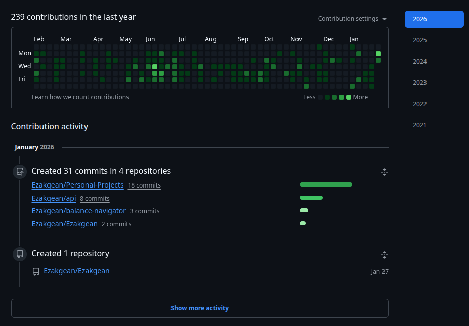

  

  

  
  
  

---

## Sobre Mim / About Me

| 🇧🇷 Português | 🇺🇸 English |
|---|---|
| Sou um desenvolvedor **Full Stack** focado em construir aplicações web **escaláveis**, **seguras** e com ótima **experiência de uso**. Gosto de sistemas bem modelados, APIs previsíveis e interfaces rápidas. | I'm a **Full Stack Developer** focused on building **scalable**, **secure**, and **high‑performance** web applications. I care about clean architecture, reliable APIs, and fast, polished UIs. |

---

## O Que Entrego / What I Deliver

| 🇧🇷 Português | 🇺🇸 English |
|---|---|
| REST APIs com versionamento, documentação clara e contratos estáveis. | REST APIs with versioning, clear documentation, and stable contracts. |
| Frontends modernos com foco em componentização, performance e SEO. | Modern frontends focused on reusability, performance, and SEO. |
| Modelagem de dados e otimização de consultas para reduzir gargalos reais. | Data modeling and query optimization to remove real bottlenecks. |
| Ambientes consistentes (dev/staging/prod) e deploys mais previsíveis. | Consistent environments (dev/staging/prod) and more predictable deployments. |
| Integrações e automações (scraping, pipelines e tarefas repetitivas). | Integrations and automation (scraping, pipelines, repetitive tasks). |
| Segurança aplicada: autenticação, validação, hardening e boas práticas. | Applied security: authentication, validation, hardening, and best practices. |

---

## Stack Principal / Core Stack

  
  
  
  
  
  
  

  
  
  
  
  
  

---

## Princípios / Principles I Work By

| 🇧🇷 Português | 🇺🇸 English |
|---|---|
| Clareza primeiro: prefiro soluções simples, explícitas e fáceis de manter. | Clarity first: I prefer simple, explicit, and maintainable solutions. |
| Performance como feature: otimizo onde isso muda a experiência do usuário. | Performance as a feature: I optimize where it changes the user experience. |
| Segurança desde o início: evito “remendos” no fim do projeto. | Security from the start: I avoid last‑minute patchwork. |
| Consistência operacional: menos surpresas entre dev, staging e produção. | Operational consistency: fewer surprises between dev, staging, and production. |

---

## Atividade / Activity

  

  <em>🇧🇷 Nota: muitos projetos estão privados enquanto reformulo meu GitHub em 2026.</em> 
  <em>🇺🇸 Note: many projects are private while I rebuild my GitHub in 2026.</em>

---

## Estatísticas do GitHub / GitHub Stats

  

---

## 📁 Repositorios Publicos / Public Repositories

<!-- REPOS:START -->
- [`Ezakgean`](https://github.com/Ezakgean/Ezakgean) — Sem descricao. ⭐ 0 • Atualizado em 2026-02-02
- [`Activities`](https://github.com/Ezakgean/Activities) — Sem descricao. ⭐ 0 • Atualizado em 2026-02-02
<!-- REPOS:END -->
